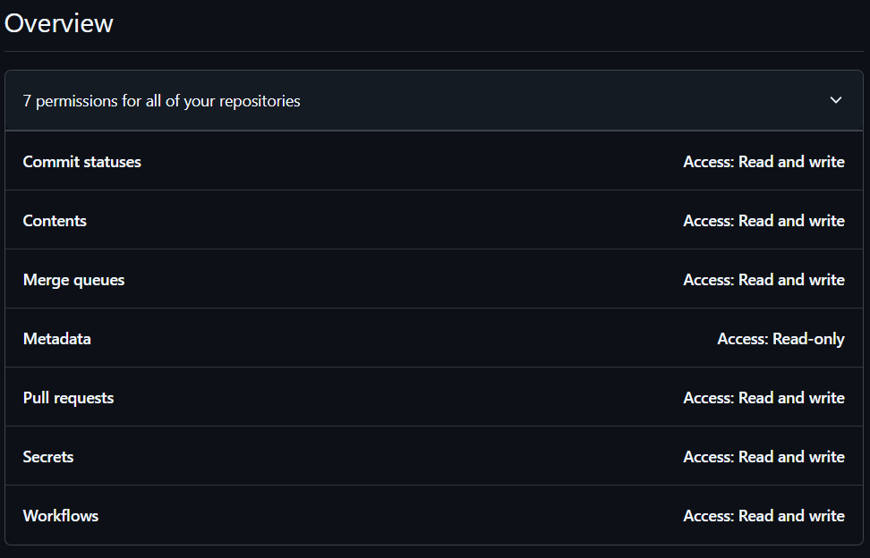

# 自动同步 Fork 仓库

这个项目提供了一个自动化工作流，用于同步 GitHub 上的 fork 仓库。

## 功能特点

- 自动同步所有 fork 的仓库
- 每天定时运行
- 支持手动触发
- 使用 GitHub Actions 实现

## 工作流程

工作流程定义在 `.github/workflows/update-sync.yml` 文件中，主要包括以下步骤：

1. 检出代码
2. 设置 GitHub CLI
3. 运行同步脚本

## 配置

工作流使用以下环境变量：

- `GH_TOKEN`: GitHub 访问令牌，用于认证
- `OWNER`: 仓库所有者

这些变量在工作流文件中通过 secrets 和 GitHub 上下文进行设置。

## 使用方法

1. Fork 这个仓库
2. 在你的 GitHub 账户设置中创建一个具有适当权限的 Personal Access Token
3. 在 fork 的仓库设置中，添加一个名为 `SYNC_GITHUB_TOKEN` 的 secret，值为你创建的 token。会赋值到 `GH_TOKEN`
4. `SYNC_GITHUB_TOKEN` 需要有 `repo` 权限，参考如下
   
5. 工作流将按计划自动运行，或者你可以手动触发

## 注意事项

- 确保 `.gitignore` 文件正确配置，以避免敏感信息泄露
- 定期检查工作流日志，确保同步正常进行

## 贡献

欢迎提交 Issue 或 Pull Request 来改进这个项目。

## 许可

本项目采用 MIT 许可证。详情请见 [LICENSE](LICENSE) 文件。
